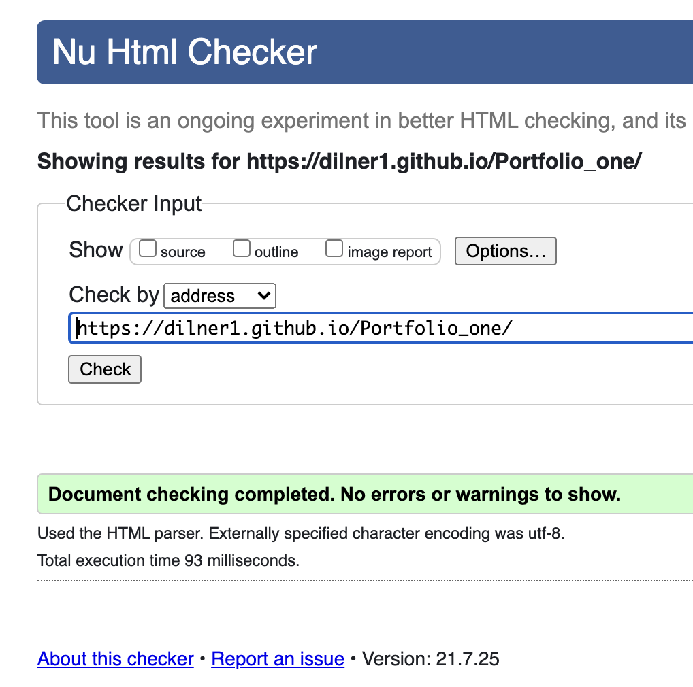
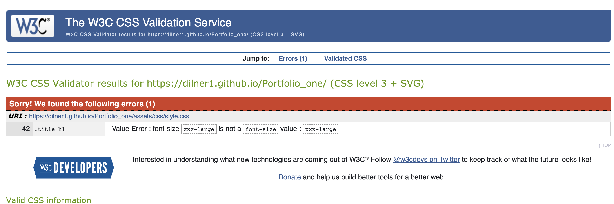

# Studio Six

Studio Six is a recording studio that allows potential clients to hire either a recording studio, one of two rehearsal rooms or book equipement through the rental service for live music. As it is a busnieness area centered around artists I wanted to give the website a bold look to really capture the eye of the potential client.

The site uses a one page format, this makes it especially easy to naviagte on mobile and doesn't hinder use on a desktop. This also gives the site a sleek and modern feel.

# Features

## Opening Screen

- opening section of the page starts with a large, bright and colorful picture and focuses eye on central logo

- this is an attempt to make the site memorable and unique.

## Navigation Bar

- Navigation is located under the logo in large bold text, in plain white as not to be too distracting but still clear for poor eyesite users. Uses a shadow to stand out from background.

- Has hover function that changes the nav colour however I am not sure if the accessability on lighthouse score takes this into concideration. 

- As is a one page site have not included an 'active' element as not necessary.

## Who We Are

- gives short information on company, explains what the studio can do 

- As opening section is very dramatic this section was kept simple and easy to read

- Uses wide line-spacing and solid background to achieve this

## Rooms

- Uses image gallary to seperate sections

- Shows the specific rooms that can be booked

# Equipment 

- Similar to Who We Are section, focus on ease of reading.

- Contains a brief disclaimer for anyone wanting to use this service

- Encourages peopclientsle to book early and get in contact through bookings section below

# Bookings

- Form for users that covers all of the above areas

- requires name / email, what service they would like and a text box to give aditional context

# Footer

- Links to social media

- Bold white against dark grey / near black

- like navigation has hover colour 

# Testing

## validation
- Have tested HTML validation with no errors

- Have tested CSS with one error that is easily fixed

- Tested Lighthouse on mobile

- Tested Lighthouse on desktop

# Solved Bugs

## Linking Images
Ran into a bug almost immediately, after the initial submit and deployment to github the site did not update, 

This was because the css was not linked correctly - had gone out of the directory because I used file path ../assets/images/nameofpicture.jpeg - when i removed the .. it worked as the index file is located next to the assets file.

Similarly later on images in the Rooms section would not load, the file path looked correct remembering my mistake from last time. I relalised this was because I had put / in front of assets. Removing this connected the links.

Did not have the same issue linking the navigation or social media.

## Responsive Elements

Had an issue with the form sections text and email boxes as they would not line up in the centre of the page. this was not an issue with the inquiery section that contains the radio buttons. The problem was more pronounced when used on tablet and desktop, so originally I used margin with percentages to fix this however it still persisted, tried padding and changing different display element types.

The issue stopped when I removed the display element, the natural flow of the page correted the mistake as it was already responsive. This has taught me it is very easy to over code something.

