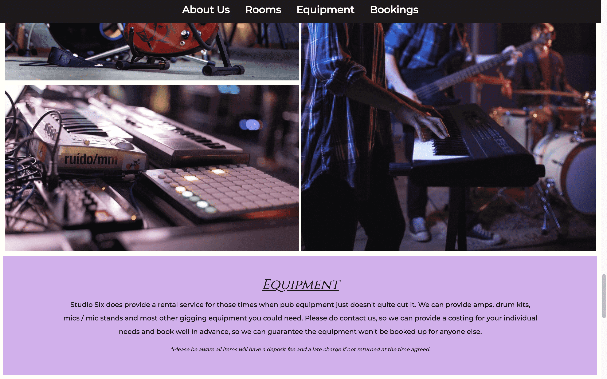
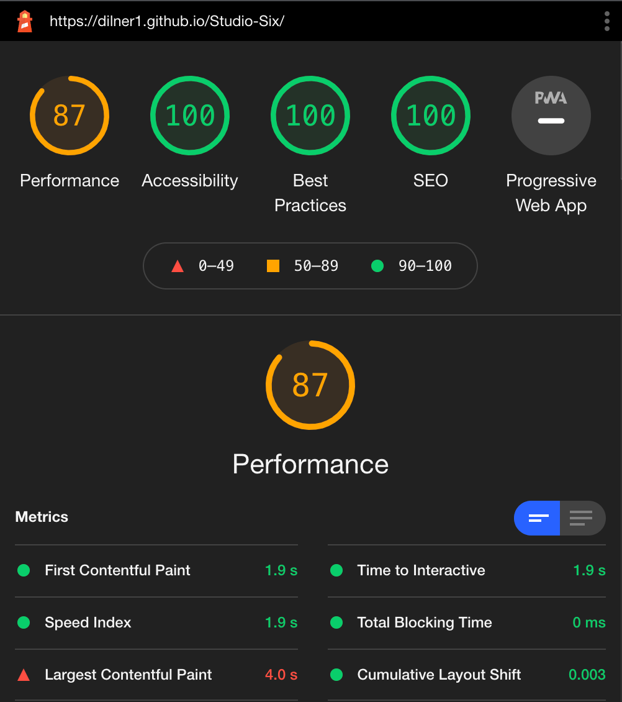

# Studio Six

Studio Six is a recording studio that allows potential clients to hire either a recording studio, one of two rehearsal rooms or book equipment through the rental service for live music. As it is a business area centered around artists I wanted to give the website a bold look to really capture the eye of the potential client.

The site uses a one-page format, this makes it especially easy to navigate on mobile and doesn't hinder use on a desktop. This also gives the site a sleek and modern feel.

# Features

## Opening Screen

- Opening section of the page starts with a large, bright and colorful picture which focuses the eye on the central logo 

- The image immediately lets users know this is a music orientated website

- A border was used to give this section an almost postcard like effect, this border styling was used throughout the design

## Navigation Bar

- The navigation bar is located under the header and sticks to the top when scrolling down

- A bar that sticks seemed like the most appropriate choice for a site that requires a lot of scrolling

- Has hover function that changes the navigation colour, this matches the logo background color

## Who We Are

- Gives a short section of information on company, explains what the studio can do 

- As the opening section is very dramatic this was kept simple so the reader is not distracted from the text

- Uses wide line-spacing and solid background to achieve this, as well as different font for headings and paragraphs

## Rooms

- Uses image gallery to separate sections

- Shows the specific rooms that can be booked

- Some pictures have a responsive design for larger screen sizes, placing them next to each other. This prevents the images from pixelating and gives a more interesting layout than just one picture on top of another

## Equipment 

- Similar to the Who We Are section, focuses on ease of reading with font, line spacing and padding

- Contains a brief disclaimer for anyone wanting to use this service and encourages clients to get in contact through bookings section below

 ## Bookings form

- A booking and inquiry form for users

- Requires name / email, what service they would like and a text box at the bottom to give additional context

- Inquiry sub section changes color on hover and also requires one of these to be selected

## Footer

- Links to social media

- Bold white against very dark grey

- Like the navigation bar it also has a hover colour

- Directs user to the respective site on a new page

# Testing

## validation

- No errors were returned when passing through the official Validator

- No errors were returned when passing through the official validator

- Tested Lighthouse on mobile

- Tested Lighthouse on desktop

Initially the lighthouse scores were quite good however the performance was lacking. When testing the lighthouse score I noticed that even after I reduced the image file sizes the performance score was still fluctuating around 70 - 81. The main image was being flagged although it is only 307 KB - I believe this is because it is a detailed image with a wide variety of colors and high contrast. I tested by reducing the padding size on the Desktop version so less of the image showed. This immediately improved the performance.

Although I prefer the look of a larger main image size it does hamper the performance score. Reducing the padding to 10% top and bottom gives the Desktop a score of 91. Reducing the padding by the same amount on mobile doesn't have as much of an effect on the score unfortunately.

## File Paths

A bug I experienced almost immediately was after the initial submit and deployment to github. The site did not update any CSS because the css was not linked correctly - I had gone out of the directory because I used the file path '../assets/images/nameofpicture.jpeg' - when i removed the '..' it worked as the index file is located next to the assets file.

Similarly I encountered an issue with the images in the Rooms section would not load, the file path looked correct as I compared it to my mistake above. I relalised this was because I had put '/' in front of assets. Removing this connected the links.

I did not have issues linking the navigation or social media icons.

## Responsive Elements

I opted for a mobile first approach, although I didn't need to change much a responsive design I find it a challenge scalling up to desktop in the areas I wanted to adjust.

I had an issue with the form sections text and email boxes as they would not line up in the centre of the page. I did not have the same issue with the inquiery section that contains the radio buttons. The problem was more pronounced when used on tablet and desktop, originally I used a margin with percentages to fix this however it still persisted, I also tried padding and changing different display element types.

- Mobile version looks fine

- Desktop version is clearly out of line

The issue stopped when I removed the display element, the natural flow of the page correted the mistake as it was already responsive. This has taught me it is very easy to over code something.

# Footer and Form alignment

This section is not in regards to a page breaking error however for design purposes it made the site look unpolished.

I found that although on my mobile design the social media fonts seemed inline it was clear on the full sized screen they were not. When I looked at the elements using inspect the icons were pushed to one side so I atempted several methods to change this from padding and margin values, display types to vertical alignment.

However after using stack overflow I discovered giving that giving the icons a width value and removing the padding actually corrected this.

After spending so much time on this section I also realised the radio input dots in the inquiery section were also slightly out of line with their text. the reason was I set the margin-left to 50%, this again looked correct on mobile but clearly not on a larger screen. Changing this to instead margin: 0 atuo; fixed this issue.

## Dark Mode

I tested the site on my own mobile which happened to be in dark mode, this of course adjusted the colours used. Although it would take a lot more investigation to learn how to make adjustments I was mostly happy with how it looked. The only issue was that the main picture border was different to the border color in used rest of the site despite using the same colour value.

There is a background colour of near white, I also created a border for the main picture with the same value. In other sections of the site the border was created by using margins rather than a border. I assumed this main pictures border was causing some overlay, by changing this to a margin this removed the issue. I have no plans to make any other changes to the dark mode, having uniform colours is good enough at this stage.

# Unfixed Bugs

## Navigation and links

Whilst not a bug as such I have found that when I move to a section of the page it crops out the titles, this is because of the navigation bar that sticks to the top of the page. I would still keep the navigation bars design as it is very useful for the user. To compensate I added more padding above the headings. This worked for the desktop perfectly fine however the padding I would need to add to the mobile version would be so significant that it would look out of place.

in the future I would look to correct this for the mobile version, however I don't currently posses the skills to be fix this the way I would want to.

# deployment

The site was deployed to GitHub pages. The steps to deploy are as follows:

In the GitHub repository, navigate to the Settings tab
From the source section drop-down menu, select the Master Branch
Once the master branch has been selected, the page will be automatically refreshed with a detailed ribbon display to indicate the successful deployment.

The live link can be found here - https://dilner1.github.io/Studio-Six/

# credits

## content

- Font was sourced from Google Fonts https://fonts.google.com/

- Icons were sourced from Font Awesome https://fontawesome.com/

- I used tinypng to mninimize the image file sizes https://tinypng.com/

## media

- All pictures were taken from the open source site Pexels https://www.pexels.com/