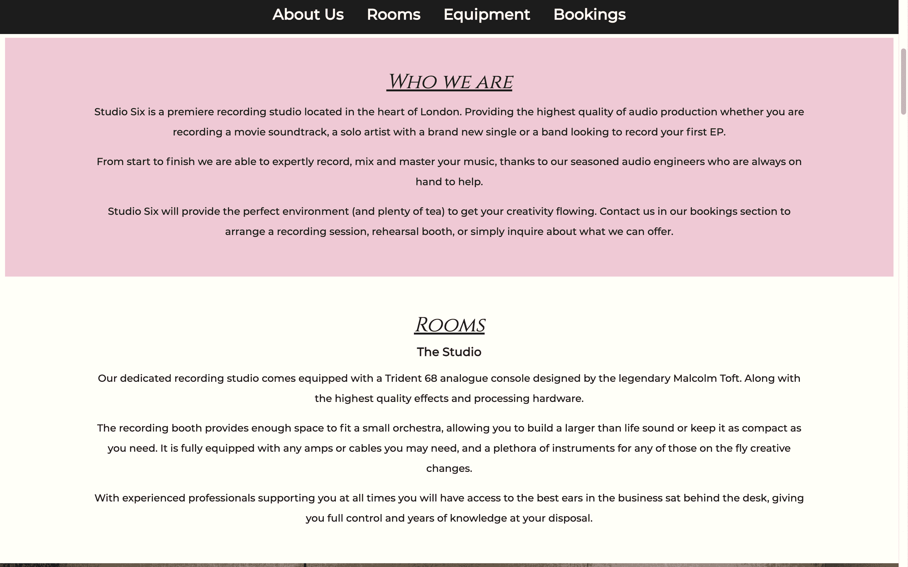
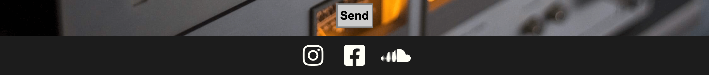

# Studio Six

Studio Six is a recording studio that allows potential clients to hire either a recording studio, one of two rehearsal rooms or book equipement through the rental service for live music. As it is a busnieness area centered around artists I wanted to give the website a bold look to really capture the eye of the potential client.

The site uses a one page format, this makes it especially easy to naviagte on mobile and doesn't hinder use on a desktop. This also gives the site a sleek and modern feel.

# Features

## Opening Screen

- opening section of the page starts with a large, bright and colorful picture and focuses eye on central logo

- this is an attempt to make the site memorable and unique.

## Navigation Bar

- Navigation is located under the header and sticks to the top when scrolling down

- Has hover function that changes the nav colour 

- As is a one page site have not included an 'active' element as not necessary.

## Who We Are

- gives short information on company, explains what the studio can do 

- As opening section is very dramatic this section was kept simple and easy to read

- Uses wide line-spacing and solid background to achieve this

## Rooms

- Uses image gallary to seperate sections

- Shows the specific rooms that can be booked

## Equipment 

- Similar to Who We Are section, focus on ease of reading.

- Contains a brief disclaimer for anyone wanting to use this service and encourages clients to get in contact through bookings section below

 ## Bookings form

- Form for users that covers all of the above areas

- requires name / email, what service they would like and a text box to give aditional context.

- Inquiery section changes color on hover and also and also requires one of these to be selected

## Footer

- Links to social media

- Bold white against dark grey / almost black

- like the navigation bar it also has a hover colour 

- Directs user to the respective site on a new page

# Testing

## validation

- No errors were returned when passing through the official Validator

- No errors were returned when passing through the official validator

- Tested Lighthouse on mobile

- Tested Lighthouse on desktop

When testing the lighthouse score I noticed that even after I reduced the image file sizes the Performance score was still around 70 - 81. the main image was being flagged although it is only 307 KB - because it is a details image with a wide variety of colours and high contrast I tested reducing the padding size on the Desktop version so less of the image showed. This immediately improved the Performance.

 The performance for the mobile stayed the same. Although I prefer the look of a larger main image size it does hamper the performance score significantly. Reducing the padding to 10% top and bottom gives the Desktop a score of 97. Reducing the padding by the same amount only yields a performance of 81 on mobile.

## File Paths

I ran into a bug almost immediately, after the initial submit and deployment to github the site did not update, this was because the css was not linked correctly - I had gone out of the directory because I used the file path '../assets/images/nameofpicture.jpeg' - when i removed the '..' it worked as the index file is located next to the assets file.

Similarly I encountered an issue with the images in the Rooms section would not load, the file path looked correct as I compared it to my mistake above. I relalised this was because I had put '/' in front of assets. Removing this connected the links.

I did not have issues linking the navigation or social media icons.

## Responsive Elements

The site was designed with a mobile first approach. 

Had an issue with the form sections text and email boxes as they would not line up in the centre of the page. this was not an issue with the inquiery section that contains the radio buttons. The problem was more pronounced when used on tablet and desktop, so originally I used margin with percentages to fix this however it still persisted, tried padding and changing different display element types.

- Mobile version looks fine

- Desktop version is clearly out of line

The issue stopped when I removed the display element, the natural flow of the page correted the mistake as it was already responsive. This has taught me it is very easy to over code something.

# Footer and Form alignment

This section is not in regards to a page breaking error however for design purposes it made the site look unpolished.

I found that although on my mobile design the social media fonts seemed inline it was clear on the full sized screen they were not. When I looked at the elements using inspect the icons were pushed to one side so I atempted several methods to change this from padding and margin values, display types to vertical alignment.

However after using stack overflow I discovered giving that giving the icons a width value and removing the padding actually corrected this.

After spending so much time on this section I also realised the radio input dots in the inquiery section were also slightly out of line with their text. the reason was I set the margin-left to 50%, this again looked correct on mobile but clearly not on a larger screen. Changing this to instead margin: 0 atuo; fixed this issue.

# Unfixed Bugs

Whilst not a bug as such I have found that when I move to a section of the page it crops out the titles, this is because of the navigation bar that sticks to the top of the page. I would still keep the navigation bars design as it is very useful for navigating the page however to clean up the design I would look to change where the link takes the user. 

# deployment

The site was deployed to GitHub pages. The steps to deploy are as follows:

In the GitHub repository, navigate to the Settings tab
From the source section drop-down menu, select the Master Branch
Once the master branch has been selected, the page will be automatically refreshed with a detailed ribbon display to indicate the successful deployment.

The live link can be found here - https://dilner1.github.io/Studio-Six/

# credits

## content

- Font was sourced from Google Fonts https://fonts.google.com/

- Icons were sourced from Font Awesome https://fontawesome.com/

- I used tinypng to mninimize the image file sizes https://tinypng.com/

## media

- All pictures were taken from the open source site Pexels https://www.pexels.com/