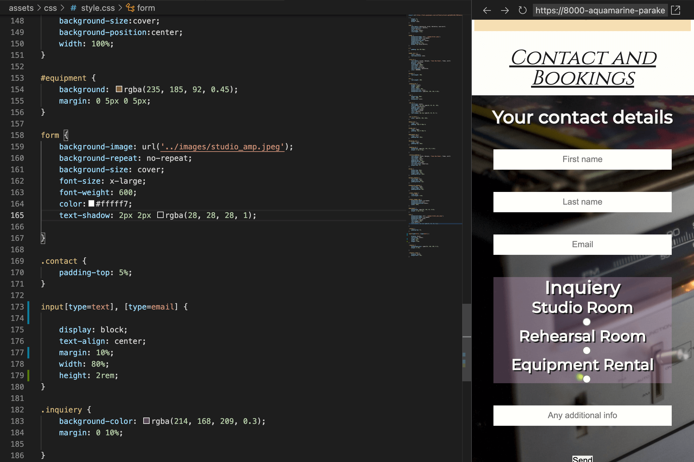

# Studio Six

Studio Six is a recording studio that allows potential clients to hire either a recording studio, one of two rehearsal rooms or book equipment through the rental service for live music. As it is a business area centered around artists I wanted to give the website a bold look to really capture the eye of the potential client.

The site uses a one-page format, this makes it especially easy to navigate on mobile and doesn't hinder ease of use on a desktop because of its navigation bar. This also gives the site a sleek and modern feel.

# Features

## Opening Screen

- Opening section of the page starts with a large, bright and colorful picture which focuses the eye on the central logo 

- The image immediately lets users know this is a music orientated website

- A border was used to give this section an almost postcard like effect, this border styling was used throughout the design

## Navigation Bar

- The navigation bar is located under the header and sticks to the top when scrolling down

- A bar that sticks seemed like the most appropriate choice for a site that requires a lot of scrolling

- Has hover function that changes the navigation colour, this matches the logo background color

## Who We Are

- Gives a short section of information on company, explains what the studio can do 

- As the opening section is very dramatic this was kept simple so the reader is not distracted from the text

- Uses wide line-spacing and solid background to achieve this, as well as different font for headings and paragraphs

## Rooms

- Uses image gallery to separate sections

- Shows the specific rooms that can be booked

- Some pictures have a responsive design for larger screen sizes, placing them next to each other. This prevents the images from pixelating and gives a more interesting layout than just one picture on top of another

## Equipment 

- Similar to the Who We Are section, focuses on ease of reading with font, line spacing and padding

- Contains a brief disclaimer for anyone wanting to use this service and encourages clients to get in contact through bookings section below

 ## Bookings form

- A booking and inquiry form for users

- Requires name / email, what service they would like and a text box at the bottom to give additional context

- Inquiry sub section changes color on hover and also requires one of these to be selected

## Footer

- Links to social media

- Bold white against very dark grey

- Like the navigation bar it also has a hover colour

- Directs user to the respective site on a new page

# Testing

## Responsive Design

I opted for a mobile first approach, after researching this seemed to be the best practice and should mean slightly less coding overall. For the most part this seemed to be the case, however adjusting the images for a responsive design did become very time consuming.

- This is the mobile version with images stacked ontop of each other

The flow of the mobile version works well with the images to break up sections, however moving to desktop the images take up much of the screen and became overpowering - some images also started to pixelate. In response to this some images were moved into columns so they could share space. 

This was particularly difficult with the second group of images (pictured below) as there was a lot of white space left. There are several ways to deal with this but I opted to fill this in with a quote as this breaks the page up further, I also did not want to stretch or resize any images.

This approach was quite troublesome because more white space appeared in response to the screen size increasing, or when decreasing it pushed the right hand side image down. There are several media querys that adjust the quote size, I also found that using a padding of 5% rather than a rem value responded much better to size changes.

## File Paths

The first bug I experienced was after the initial submit and deployment to github. The site did not update any CSS because it was not linked correctly. I used the file path '../assets/images/nameofpicture.jpeg' which took me out of the directory, when i removed the '..' it worked as the index file is located next to the assets file.

Similarly I encountered an issue with the images in the Rooms section, the file path looked correct as I compared it to my mistake above. I relalised the error was because I had put '/' in front of assets. Removing this connected the links. Because of these simple issues I now have a much better understanding of file paths in Github.

There was no issue linking the navigation or social media icons. The media icons link to seperate pages, there is an issue with the location the nav bar takes you which is discussed in the unfixed bugs section (although this is quite minor).

## Navigation Bar 

The sticky navigation bar works very well, however I noticed that when scrolling there were times where the background could be seen between the top of the screen and the top of the bar (although it was only about a pixel in height so not very obvious). When I originally looked at stack overflow to create the nav bar the information given was to set the top value to 0px. As there was no other obvious reason as to why there would be break between the bar and the top of the screen I changed the value to -1 which fixed the issue.

## Form Alignment

There was an issue with the form sections text and email boxes as they would not line up in the centre of the page. I did not have the same issue with the inquiery section that contains the radio buttons. The problem was more pronounced when used on tablet and desktop, originally I used a margin with percentages to fix this however it still persisted, I also tried padding and changing different display element types.

- Mobile version looks fine

- Desktop version is clearly out of line

The issue stopped when I removed the display element, the natural flow of the page corrected the mistake as it was already responsive. This has taught me it is very easy to add unecessary code.

I noticed  the radio input dots in the inquiery section were also slightly out of line with the text. the reason was I set the margin-left to 50%, this again looked correct on mobile but clearly not on a larger screen. Changing this to instead margin: 0 atuo; fixed the issue.

## Footer

I found that although on my mobile design the social media fonts seemed inline it was clear on the full sized screen they were not. When I looked at the elements using inspect the icons were pushed to one side so I atempted several methods to change this from padding and margin values, display types to vertical alignment.

However after using stack overflow I discovered giving that giving the icons a width value and removing the padding actually corrected this.

## Dark Mode

I tested the site on my own mobile which is set to dark mode, this of course adjusted the colours used. Although it would take a lot more investigation to learn how to customize this I was mostly happy with how it looked. The only issue was that the main picture border was different to the border color in used rest of the site despite using the same colour value.

The standard site has a white background, I also created a border for the main picture with the same colour value. In other sections of the site the border was created by using margins rather than a border. I assumed the pictures border was causing overlay, by changing this to a margin this removed the issue. I have no plans to make any other changes to the dark mode, having uniform colours is good enough at this stage.

## validation

- No errors were returned when passing through the official Validator

- No errors were returned when passing through the official validator

- Tested Lighthouse on mobile

- Tested Lighthouse on desktop

The lighthouse scores are quite good however there is a difference between the mobile and desktop version in regards to performance. the biggest issue seems to be images not having a width or height value, however adding these does not seem like best practice. 

Several people have tested my site, it works well on various devices with many positive comments about layout and design. None of the testers have any knowledge of HTML or CSS so could not comment on the code.

# Unfixed Bugs

## Navigation and links

Whilst not a site breaking bug I have found that when I move to a section of the page it crops out the titles, this is because of the navigation bar that sticks to the top of the page. I would still keep the navigation bars design as it is very useful for the user. To compensate I added more padding above the headings. This worked for the desktop perfectly fine however the padding I would need to add to the mobile version would be so significant that it would look out of place.

in the future I would look to correct this for the mobile version, however I don't currently posses the skills to be fix this the way I would want to.

# deployment

The site was deployed to GitHub pages. The steps to deploy are as follows:

In the GitHub repository, navigate to the Settings tab
In the pages section, go to select branch drop-down menu, select Main
Once the Main branch has been selected, a link to the site is provided

The live link can be found here - https://dilner1.github.io/Studio-Six/

# credits

## content

- Font was sourced from Google Fonts https://fonts.google.com/

- Icons were sourced from Font Awesome https://fontawesome.com/

- I used tinypng to minimize the image file sizes https://tinypng.com/

## media

- All pictures were taken from the open source site Pexels https://www.pexels.com/